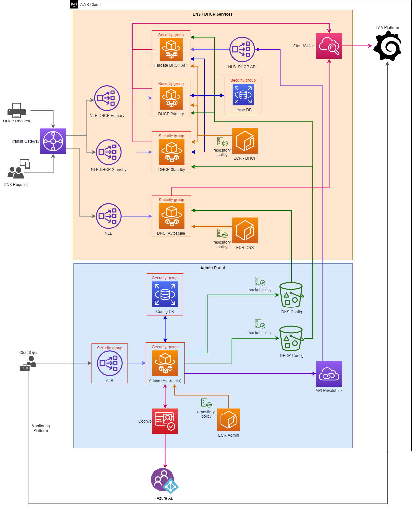

# DNS / DHCP AWS Infrastructure

## Introduction

This repository contains the Terraform code to build the AWS infrastructure for the Ministry of Justice's DNS and DHCP platform. The infrastructure is implemented in AWS and applied using [AWS CodePipelines](https://aws.amazon.com/codepipeline/) specified in the Shared Services management account.

The running applications are defined and run as docker containers using [AWS Fargate](https://aws.amazon.com/fargate/)

## Related Repositories

This repository defines the **system infrastructure only**. Specific components and applications are defined in their own logical external repositories.

- [Shared Services](https://github.com/ministryofjustice/pttp-shared-services-infrastructure)
- [DNS DHCP Admin Portal](https://github.com/ministryofjustice/staff-device-dns-dhcp-admin)
- [DNS Server](https://github.com/ministryofjustice/staff-device-dns-server)
- [DHCP Server](https://github.com/ministryofjustice/staff-device-dhcp-server)
- [Docker Base Images](https://github.com/ministryofjustice/staff-device-docker-base-images)

## Other Documentation

- [Getting Started](documentation/getting-started.md)
- [Authentication with Azure AD](documentation/azure-ad.md)
- [Corsham Site Tests](documentation/corsham-test.md)
- [Deployment](documentation/deployment.md)
- [Secrets Management](documentation/secrets_management.md)

## Architecture

[Image Source](diagrams/pttp-dns-dhcp-infra.drawio)
