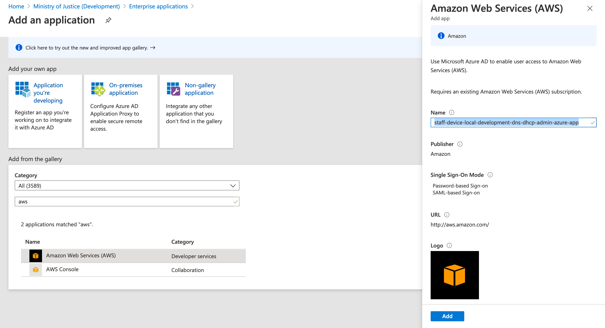
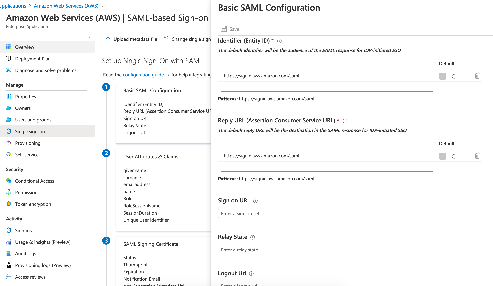
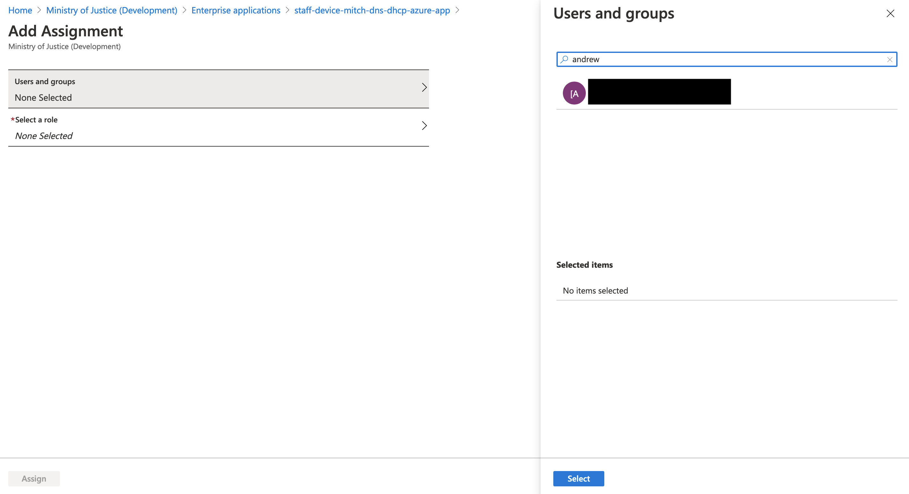

# DNS / DHCP Azure AD SSO Provisioning

## Prerequisites
* You will need access to a Devl MoJ account (ask in the Slack channel for this)
* In Azure you will need to elevate your permissions using `Privileged Identity Management (PIM)`

## Creating the basic app
1. In the Azure portal, navigate to `Enterprise Applications`
1. Click `Add` application
1. Select `Amazon Web Services (AWS)` application from the list of predefined services
1. Change the application name to `staff-device-[ENVIRONMENT_NAME]-dns-dhcp-admin-azure-app`
1. Click `Add`. Creating the app may take a few moments. You will eventually be redirected to the config page.




## Configuring roles 
1. In the Azure portal, navigate to `App Registrations`
1. Search for the application name (used to create the app above). ie `staff-device-[ENVIRONMENT_NAME]-dns-dhcp-admin-azure-app` and click to navigate to the configuration page.
1. Select `Manifest` in the left hand menu bar.
1. Add 2 new roles to the existing `appRoles` section for editor and viewer. Do not delete the existing `msiam_access` role. A unique GUID must be created for each of the new roles. These can be created [here](https://www.guidgenerator.com/online-guid-generator.aspx).
```json
{
	"allowedMemberTypes": [
		"User"
	],
	"description": "Viewer users have the ability to view DNS/DHCP configurations.",
	"displayName": "Viewer",
	"id": MY_CUSTOM_GUID,
	"isEnabled": true,
	"lang": null,
	"origin": "Application",
	"value": "viewer"
},
{
	"allowedMemberTypes": [
		"User"
	],
	"description": "Editor users have the ability to create, delete and update DNS/DHCP configurations.",
	"displayName": "Editor",
	"id": MY_CUSTOM_GUID,
	"isEnabled": true,
	"lang": null,
	"origin": "Application",
	"value": "editor"
}
```
1. Save the changes to the manifest.

## Configuring URLs
1. In the Azure portal, navigate to `Enterprise Applications`
1. Search for the application name, ie `staff-device-[ENVIRONMENT_NAME]-dns-dhcp-admin-azure-app` and select it
1. On the left-hand menu, select `Single sign-on` and select `SAML`

1. Select `Edit` in `Basic SAML Configuration`

1. Fill in the `Identifier (Entity ID)` with `urn:amazon:cognito:sp:[COGNITO_USER_POOL_ID]`
	To find the COGNITO_USER_POOL_ID:
	1. In the AWS Console, navigate to `Cognito` then `Manage User Pools` and select your app
	1. Under `General Settings` locate `Pool Id`
1. Fill in the `Reply URL (Assertion Consumer Service URL)` with `https://[COGNITO_DOMAIN]/saml2/idpresponse`
	To find the COGNITO_DOMAIN:
	1. In the AWS Console, navigate to `Cognito` then `Manage User Pools` and select your app
	1. Under `App Integrations` then `Domain name`, locate the full domain, ie `https://some-user-pool-name.auth.eu-west-2.amazoncognito.com`
1. Fill in the `Logout Url` with output from Terraform



## Assigning roles to users
1. In the Azure portal, navigate to `Enterprise Applications`
1. Search for the application name, ie `staff-device-[ENVIRONMENT_NAME]-dns-dhcp-admin-azure-app` and select it
1. On the left-hand menu, select `Users and groups`
1. At the top of the user list select `Add user`
1. On the `Add assignment page` click `Users and groups`. Search for the user you would like to add to the application.

1. Back on the `Add assignment page` click `Select a role`. Click on the role and then click `select`

1. Click on `Assign`. You will now see your user in the list of users with the role assignment.
