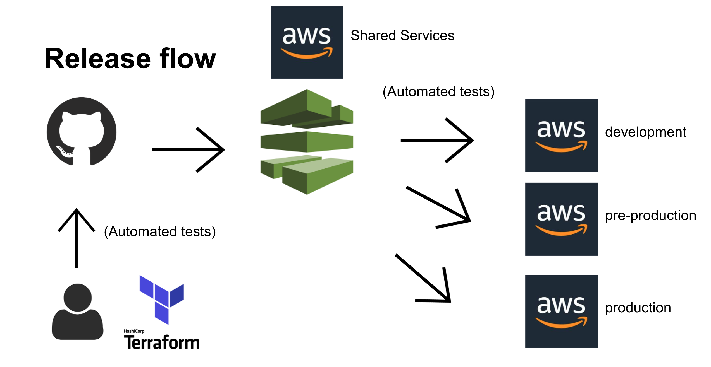

# Deployment

The infrastructure is deployed through [AWS CodePipeline](https://aws.amazon.com/codepipeline/#:~:text=AWS%20CodePipeline%20is%20a%20fully,reliable%20application%20and%20infrastructure%20updates.).

## Environments

There are 3 AWS environments that run this service. Each one in a separate AWS account:

1. Development
2. Pre-production
3. Production

The environments are deployed from a [Shared Services](https://github.com/ministryofjustice/staff-device-shared-services-infrastructure) AWS account by assuming a [pre-defined IAM role](https://docs.aws.amazon.com/IAM/latest/UserGuide/tutorial_cross-account-with-roles.html) into the target account.

The [source code](https://github.com/ministryofjustice/staff-device-shared-services-infrastructure) for the pipeline is available on Github.

Each deploy is immutable and installs the dependencies from scratch in a new build container.

## Continuous integration

Trunk based development and pull requests are currently used to add new features or updates to the service.
Feature branches should be short lived and merged into the master branch frequently. CodePipeline picks up any new commits on the master branch and runs them against the various environments automatically. Depending on the changes that are made, deployments should be applied with zero downtime. This can be established by applying the change on your local environment before committing it to master.

## Manual confirmation of production deploy

Development and Pre-production are automatically deployed without any manual intervention, but production requires that the deploy be approved.

## Deployment manifest file

The entire release process is defined in the [buildspec.yml](../buildspec.yml) file, which is a [concept in CodePipeline](https://docs.aws.amazon.com/codebuild/latest/userguide/build-spec-ref.html) for [CodeBuild](https://aws.amazon.com/codebuild/). It allows you to define your deployments as code and gives you full control of the steps taken.

The `buildspec.yml` file currently goes through the following steps to do a deployment:

1. Set static environment variables for Terraform and bash scripts
2. Set environment variables with values pulled from SSM Parameter Store
3. Install Terraform
4. Initialize Terraform for target AWS account
5. Run Terraform to create the infrastructure
6. Publish Terraform outputs to SSM Parameter store
