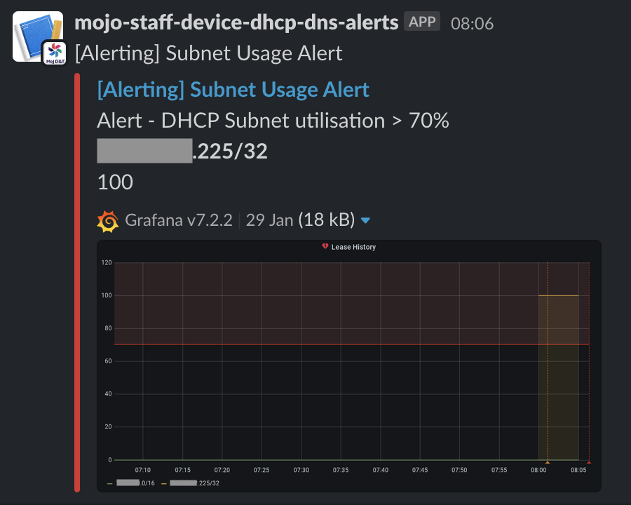

# Disaster Recovery

Unplanned downtime needs to be addressed as soon as possible to minimise disruption of end user devices.

A number of potential scenarios, their configured alarms and associated remediation steps are detailed below.

1. [Corrupt configuration file](#corrupt-configuration-file)
1. [Corrupt container was published](#corrupt-container-was-published)
1. [Misconfigured infrastructure](#misconfigured-infrastructure)
1. [DHCP Subnet gets full](#subnet-gets-full)
1. [Services Overloaded](#services-overloaded)
1. [AWS Availability Zone goes down](#availability-zone-goes-down)

## Corrupt configuration file

The [self service portal](https://github.com/ministryofjustice/staff-device-dns-dhcp-admin) allows administrators to make changes to the DNS and DHCP services in production. DHCP will have more configuration update requirements than DNS due to the need to manage subnets.

Measures have been taken to validate the changes, using service specific tools.
This should prevent corrupt configurations from being published.

[Image Source](./diagrams/config-validation.drawio)

### DHCP

The Kea API [config-test](https://kea.readthedocs.io/en/kea-1.8.2/api.html?#config-test) command is used to validate the configuration file before publishing to S3.

Grafana alarms, in the [IMA platform](https://github.com/ministryofjustice/staff-infrastructure-monitoring-config), are configured to go off in this situation.
The specific metrics that are being monitored to make this visible are:

- Unhealthy host count
- Running task count
- Kea error count

### DNS

Bind verifies the configuration using the [named-checkconf](https://bind9.readthedocs.io/en/v9_16_8/configuration.html) command.

While these tools have proven to be reliable, if any configuration error was to get through, it could lead to the new instance of the server failing to boot.

Grafana alarms, in the [IMA platform](https://github.com/ministryofjustice/staff-infrastructure-monitoring-config), are configured to go off in this situation.
The specific metrics that are being monitored to make this visible are:

- Unhealthy host count
- Running task count

Either of these alarms going off could indicate a bad configuration file was published.

To recover from this situation, a utility script exists that can be run to roll back to a previously known good version. Please see [Staff Device DNS DHCP Disaster Recovery](https://github.com/ministryofjustice/staff-device-dns-dhcp-disaster-recovery)

## Corrupt container was published

If a bug is introduced into either of the DNS or DHCP server containers, it may cause downtime.

Automated tests are run in the build pipeline which prevent a container from being pushed to AWS ECR on failure.

Grafana alarms are configured to go off in this situation.
The specific metrics that are being monitored to make this visible are:

- Unhealthy host count

Remediation will take place by using the [Staff Device DNS DHCP Disaster Recovery](https://github.com/ministryofjustice/staff-device-dns-dhcp-disaster-recovery) tools.

## Misconfigured infrastructure

Regressions could be introduced either in our own infrastructure or the wider MoJ network. Identify where the failures occur by doing the following:

* Check VPC flow logs fto ensure traffic is arriving in the VPC
* Check network load balancer (NLB) metrics to ensure requests are being routed to the services
* Check elastic container service (ECS) metrics to ensure that requests are being handled

All infrastructure that make up the DNS / DHCP services is managed by Terraform. Any changes are pushed through the build pipelines and applied to all environments. The first course of action should be to re-run the pipeline to ensure the infrastructure matches the code. Any manual changes made in the AWS console will be reset to match Terraform.

It is possible to apply misconfigured infrastructure, even if it is syntactically correct.

Rolling back should be done with Git and pushed through the pipeline.

## Subnet gets full

A Grafana alarm is configured to trigger when any subnet reaches a predefined threshold of utilisation.  When this happens, the IP range will need to be increased via the admin portal.

## Services Overloaded

It is important to consider the DNS and DHCP services separately as the fundamental deployments differ. Both services are monitored in IMA dashboards.

Alarms are configured to trigger when resources required go above 70% for CPU and Memory. This type of failure can be detected early before the system reaches maximum capacity.

[DHCP performance test results](https://github.com/ministryofjustice/staff-device-dhcp-server/blob/main/documentation/performance-metrics.md)

[DNS performance test results](https://github.com/ministryofjustice/staff-device-dns-server/blob/main/documentation/performance_benchmarks.md)

### DNS Scalability

DNS is configured to scale horizontally. By design, it is unlikely that the DNS service will become overloaded.

In the event this does occur, it would be likely due to an AWS capacity issue. **E.g:** Further instances can not be provisioned in the availability zones. In this case you should refer to AWS.

### DHCP Scalability

The [High Availability](https://github.com/ministryofjustice/staff-device-dhcp-server#isc-kea-high-availability) design of Kea requires a fixed 2 server configuration. This means that Kea is not configured to scale horizontally.

Scaling up is achieved by editing the `cpu` and `memory` values in the Terraform [aws_ecs_task_definition](/modules/dhcp/ecs_task_definition.tf) and reapplying.

## Availability zone goes down

Both DNS and DHCP are designed to run in multiple availability zones. One going down will result in the other taking over.
