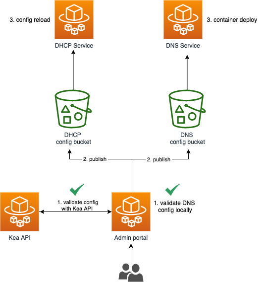

# Disaster Recovery

Unplanned downtime needs to be addressed as soon as possible to minimise disruption of end user devices.

A number of potential scenarios, how these errors will be notified as alarms and remediation steps are detailed below:

1. [Corrupt configuration file was published](#corrupt-configuration-file)
2. [Corrupt container was published](#corrupt-container-was-published)
3. [Misconfigured infrastructure](bad-infrastructure-apply-with-terraform)
4. [DHCP Subnet gets full](#dhcp-subnet-gets-full)
5. [Services Overloaded](#services-overloaded)
6. [AWS Availability Zone goes down](#aws-availability-zone-goes-down)
7. [Other AWS failures](#other-aws-failures)

## Corrupt configuration file

The [self service portal](https://github.com/ministryofjustice/staff-device-dns-dhcp-admin) allows administrators to make changes to the DNS and DHCP services in production. DHCP will have more configuration update requirements than DNS due to the need to manage subnets.

[DHCP server won't reload corrupt config file]
[DNS server launch new instances to take over]
[Investigate audit trail in the admin]

Measures have been taken to validate the changes, using service specific tools.
This should prevent any corrupt configurations from being published.

[Image Source](./diagrams/config-validation.drawio)

### DHCP

The Kea API [config-test](https://kea.readthedocs.io/en/kea-1.6.2/api.html#ref-config-test) command is used to validate the configuration file.

#### DNS

Bind verifies the configuration using the [named-checkconf](https://bind9.readthedocs.io/en/v9_16_8/configuration.html) command.

While these tools have proven to be reliable, if any configuration error was to get through, it could lead to the new instance of the server failing to boot.

Grafana alarms are configured to go off in this situation.
The specific metrics that are being monitored to make this visible are:

1. Unhealthy host count
2. Running task count

Either of these alarms going off could indicate a bad configuration file was published.

To recover from this situation, a utility script exists that can be run to roll back to a previously known good version. Please see [Staff Device DNS DHCP Disaster Recovery](https://github.com/ministryofjustice/staff-device-dns-dhcp-disaster-recovery)

## Corrupt container was published

If a bug is introduced into either of the DNS or DHCP server containers, it may cause downtime.

Automated tests are run in the build pipeline which prevent a container from being pushed to AWS ECR on failure.

Grafana alarms are configured to go off in this situation.
The specific metrics that are being monitored to make this visible are:

- Unhealthy host count

  Remediation will take place by using Git to check out a previously known good version.
  A good version can be identified by correlating metrics and ...
  This will need to be committed to the main branch and pushed through the pipeline.

- [Add ECR rollback to DR scripts]

## Misconfigured infrastructure

All infrastructure is managed by Terraform. Any updates are pushed through the build pipelines and applied to all environments. One of the first courses of action should be to re-run the pipeline to ensure the infrastructure in AWS matches the code. Any manual changes made in AWS will be restored to the code defined in Terraform.

It is not possible to prevent applying syntactically correct, but misconfigured infrastructure.

Rolling back should be done with Git and pushed through the pipeline.

[What are the steps here]

## Subnet gets full

This is only related to DHCP. In the event of a subnet filling up, the subnet will need to be increased.

[increase subnet]

## Services Overloaded

It is important to consider each of the services separately as the fundamental deployments differ. Both services are monitored in IMA dashboards.

Alarms are configured to go off when resources required go above 70% for CPU and Memory.
This type of failure can be detected early before the system reaches maximum capacity.

[Perf testing results] - TODO / remove?

### DNS Scalability

DNS is configured to autoscale, on demand, according to load. It is highly unlikely that the DNS service will become overloaded. In the event this does occur, it would be likely due to an AWS capacity issue. E.g: Further instances can not be provisioned in the AZ.

### DHCP Scalability

The [High Availability](https://github.com/ministryofjustice/staff-device-dhcp-server#isc-kea-high-availability) design of Kea requires a fixed 2 server configuration. This means that Kea is not configured to autoscale on demand.

Scaling up is achieved by editing the `cpu` and `memory` values in the terraform [aws_ecs_task_definition](/modules/dhcp/ecs_task_definition.tf), committing the changes and running the deployment pipeline.

## AZ goes down and other AWS Failures

Both DNS and DHCP are designed to run in multiple availability zones. One going down will result in the other taking over.

## Other AWS failures

Identify the failure on the [AWS status](https://status.aws.amazon.com/) page.
Get in contact with AWS as soon as possible.
