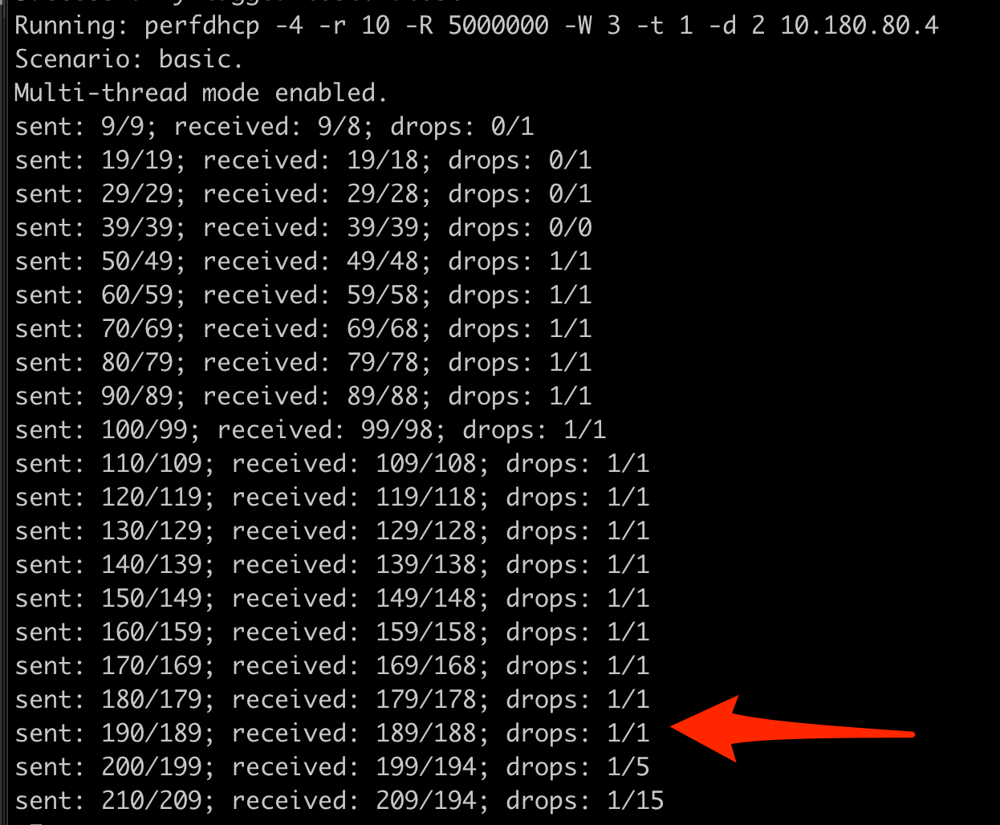
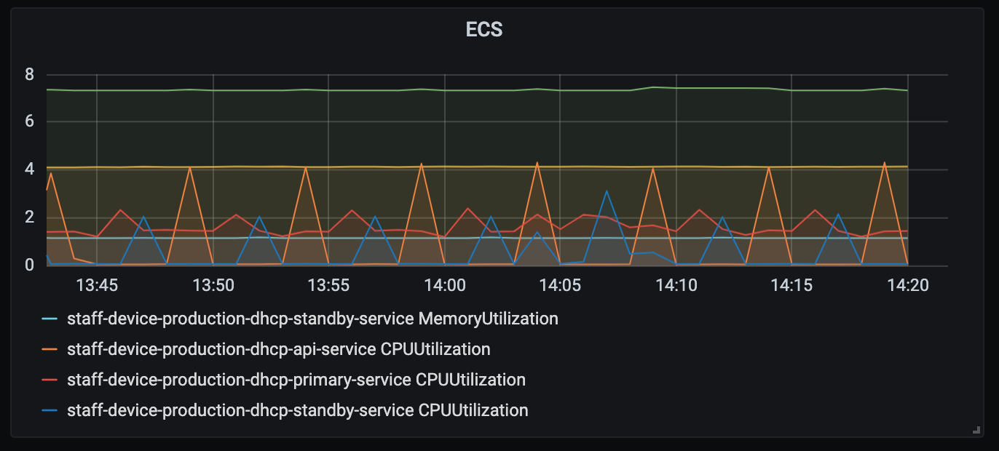
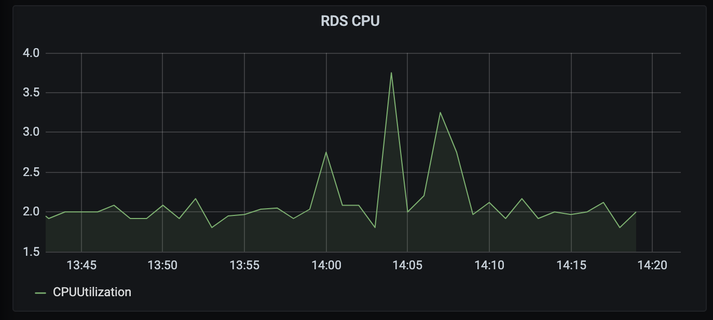
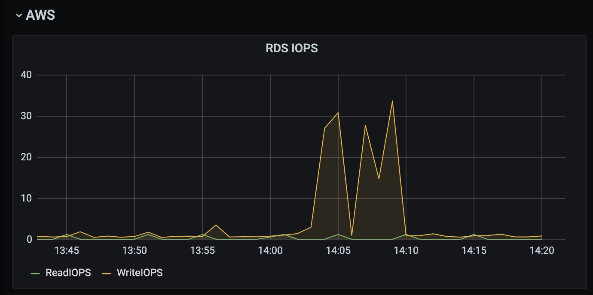
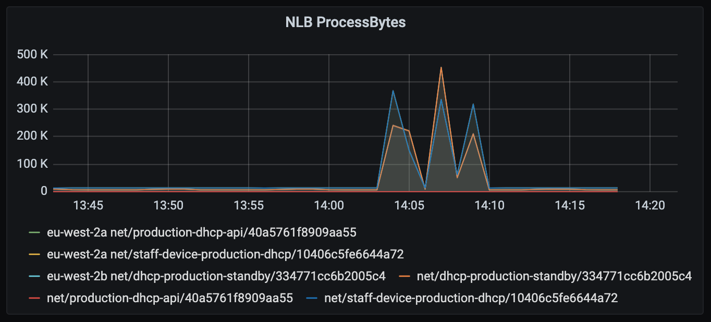

# Performance metrics

This report presents a series of measurements on [Kea version 1.8](https://github.com/ministryofjustice/staff-device-dhcp-server/blob/main/dhcp-service/Dockerfile) run on [AWS infrastructure](./README.md).

To establish the upper bound on performance for KEA, a load test was conducted on the 8th of January 2021.

## KEA Configuration

KEA is running in [hot-standby mode](https://gitlab.isc.org/isc-projects/kea/-/wikis/designs/High-Availability-Design), with a Primary and Standby server. It uses a MYSQL backend and has multi-threading enabled.

This performance test was run on a KEA instance with a JSON configuration file loaded, which included:

- 142 Sites
- 829 Subnets 
- 14404 reservations 
- At least two client classes per subnet

The configuration file is reloaded every 5 minutes to support self service from the [Admin Portal](https://github.com/ministryofjustice/staff-device-dns-dhcp-admin), which may show up as small spikes on the metrics.

The primary KEA instance also publishes metrics every 10 seconds, but this does not seem to have any impact on the instance resources.

#### NOTE:

Subnets are all configured to /24 which contains 256 available IPs.
For the purposes of this test, the subnet was expanded to allow leasing more than 256 IPs.
The remote testing site was configured to have a /16 range, which gives 65,536 available IPs.

## How to run these tests

These tests are designed to run from a remote site to give a realistic indication of the current performance of the KEA DHCP server as it will be used in production.

To gain access to the remote testing instance, please follow the steps in the [Corsham Testing](./corsham-test.md) documentation.

The remote VM has perfdhcp installed and [scripts](https://kea.readthedocs.io/en/latest/man/perfdhcp.8.html) to run these tests.

## Traffic Generation

### PerfDHCP

[Perfdhcp version 1.8.1](https://kea.readthedocs.io/en/latest/man/perfdhcp.8.html) was used and is the recommended load testing tool that is able to lease a large number of IPs.

It gradually ramps up traffic in increments of an additional 10 RPS. The drop rate is manually observed to establish the upper bound.

The following command was run to generate the traffic. 

```sh
perfdhcp -4 $ENDPOINT_IP -r10 -R 5000 -W3 -t1 -d2
```

### AWS Service metrics

#### ECS

KEA runs on ECS Fargate with the following resources configured:

- 2GB Memory
- 1GB CPU

#### RDS

The backend is a mysql database managed by AWS. There is only one database and no replication configured.

The database instance size is a [db.t2.large](https://aws.amazon.com/rds/instance-types/)

## Load test results - 8th January 20201

The test results shows that KEA can handle roughly **200 requests per second**.



It seems that there are no infrastructure bottlenecks and that Kea itself is unable to process more than this.

There was hardly a noticable effect on the container resources such as RAM and CPU.

#### ECS - Elastic Container Service



#### RDS - Relational Database Service





#### NLB - Network Load Balancer


